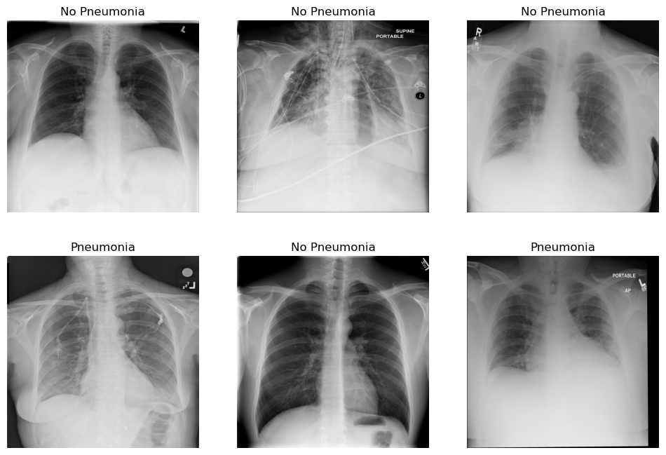

<div id="top"></div>

<!-- PROJECT LOGO -->
<br />
<div align="center">
  

  <h3 align="center">Detecting the presence of pneumonia on chest x-ray images</h3>

</div>

<!-- TABLE OF CONTENTS -->
<details>
  <summary>Table of Contents</summary>
  <ol>
    <li>
      <a href="#about-the-project">About The Project</a>
      <ul>
        <li><a href="#premise">Premise</a></li>
        <li><a href="#data">Data</a></li>
        <li><a href="#execution-plan">Execution Plan</a></li>
        <li><a href="#challenges-and-improvements">Challenges and improvements</a></li>
      </ul>
    </li>
    <li>
      <a href="#getting-started">Getting Started</a>
      <ul>
        <li><a href="#setting-up-a-conda-environment">Setting up a conda environment</a></li>
        <li><a href="#usage">Usage</a></li>
        <li><a href="#file-descriptions">File descriptions</a></li>
      </ul>
    </li>
    <li><a href="#additional-notes">Additional Notes</a></li>
    <li><a href="#license">License</a></li>
    <li><a href="#contact">Contact</a></li>
    <li><a href="#acknowledgments">Acknowledgments</a></li>
  </ol>
</details>

---

## About The Project

In this mini-project, I developed a pneumonia classifier based on a CNN-based deep learning architecture. The goal is to be able to predict the presence or absence of pneumonia on chest x-ray images.

### Premise

Routine checks of x-ray images is a very time-consuming tasks that nonetheless requires expert radiologists that have trained for years to become imaging professionals. With the advent of artificial intelligence, machine learning (ML) algorithms can be incorporated into the medical workflow to aid radiologists in their work.

Medical devices that are powered by ML algorithms can perform a multitude of tasks to make radiologists more efficient. For example, it can be used in screening studies, disease prediction and worklist prioritization.

The goal of such devices is not to replace the radiologist, but to work alongisde them to improve the accuracy and efficiency of their diagnoses.

<p align="right">(<a href="#top">back to top</a>)</p>

### Data

This project uses chest x-ray images from the NIH dataset [available on Kaggle](https://www.kaggle.com/datasets/nih-chest-xrays/data). The data mainly consists of two parts:

- **Images**: 112,120 X-ray images with disease labels from 30,805 unique patients.
- **Metadata**: Metadata of all images including technical imaging information as well as patient fields such as age and gender. Finally, one or more disease labels are included.

<p align="right">(<a href="#top">back to top</a>)</p>

### Execution plan

In order to process the data and build the classification model, the following steps were taken:

1. **Exploratory Data Analysis**: We load, clean, transform and visualize the data as needed.
2. **Model Building**: We setup all the necessary classes and functions to train our pneumonia classifier. This includes choices such as data splits and model hyper-parameters.
3. **Model Evaluation**: We use an exhaustive list of performance metrics to validate the predictions during and after training.
4. **Inference on DICOM files**: We test our algorithm in a simulated real-world case where the input images are DICOM files directly sent from the imaging devices.

### Challenges and improvements

This project was developed as a quick proof of concept, and therefore there were many areas left unexplored that could certainly be improved upon. On top of that, the lack of proper GPU resources made iterating through different solutions a painstaking process, which explains why a small architecture was chosen to train the pneumonia classifier instead of a fancier state of the art architecture.

Having said that, apart from trying out different architectures and hyper-parameters, more effort could have been put in data pre-processing. Data cleaning is, though incredibly time consuming, one of the most important tasks, if not the most important one, in data science, significantly affecting the final results when done properly.

It is unclear whether the accuracy of the labels claimed by the authors is reliable or not, and whether all images have the same quality. There are for example many images in the dataset with considerably big artifacts present, such as cables and other devices appearing between the patient and the x-ray machine. This can naturally affect the final outcome of the model and is something that needs to be incorporated in the algorithm if such artifacts are unavoidable.

To sum up, while there are definitely a myriad of more powerful architectures and hyper-parameter combinations that could be used to improve predictions, data pre-processing plays such a key role taht, when properly done, it dramatically affect the final performance of the algorithm.

<p align="right">(<a href="#top">back to top</a>)</p>

---

## Getting Started

To make use of this project, I recommend managing the required dependencies with Anaconda.

### Setting up a conda environment

Install miniconda:

```bash
wget https://repo.anaconda.com/miniconda/Miniconda3-latest-Linux-x86_64.sh
bash Miniconda3-latest-Linux-x86_64.sh
```

Install mamba:

```bash
conda install -n base -c conda-forge mamba
```

Install environment using provided file:

```bash
mamba env create -f environment.yml # alternatively use environment_hist.yml if base system is not debian
mamba activate pneumonia_detection
```

### Usage

This project is organized in a series of Jupyter notebooks that can be run in order:

1. **Exploratory Data Analysis**: `notebooks/0_eda.ipynb`.
2. **Data Modeling and Evaluation**: `notebooks/1_modeling.ipynb`.
3. **Inference**: `notebooks/2_inference.ipynb`.

### File descriptions

The project files are structured as follows:

- `data/model_outputs`: Files of the pre-trained pneumonia classifier.
- `data/test_dicom`: A series of DICOM files used to test model inference.
- `notebooks`: Location of the three main project notebooks as well as the FDA report.
- `src/data_modules`: Contains the source code of the Pytorch Lightning data module classes.
- `src/datasets`: Contains the source code of Pytorch dataset clases.
- `src/models`: Contains the source code of the classifier model.
- `src/utils.py`: Utility functions.

<p align="right">(<a href="#top">back to top</a>)</p>

---

## Additional Notes

Source files formatted using the following commands:

```bash
isort .
autoflake -r --in-place --remove-unused-variable --remove-all-unused-imports --ignore-init-module-imports .
black .
```

## License

Distributed under the MIT License. See `LICENSE` for more information.

## Contact

[Carlos Uziel Pérez Malla](https://www.carlosuziel-pm.dev/)

[GitHub](https://github.com/CarlosUziel) - [Google Scholar](https://scholar.google.es/citations?user=tEz_OeIAAAAJ&hl=es&oi=ao) - [LinkedIn](https://at.linkedin.com/in/carlos-uziel-p%C3%A9rez-malla-323aa5124) - [Twitter](https://twitter.com/perez_malla)

## Acknowledgments

This project was done as part of the [AI for Healthcare Nanodegree Program at Udacity](https://www.udacity.com/course/ai-for-healthcare-nanodegree--nd320).

<p align="right">(<a href="#top">back to top</a>)</p>
