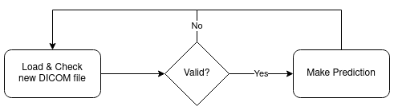
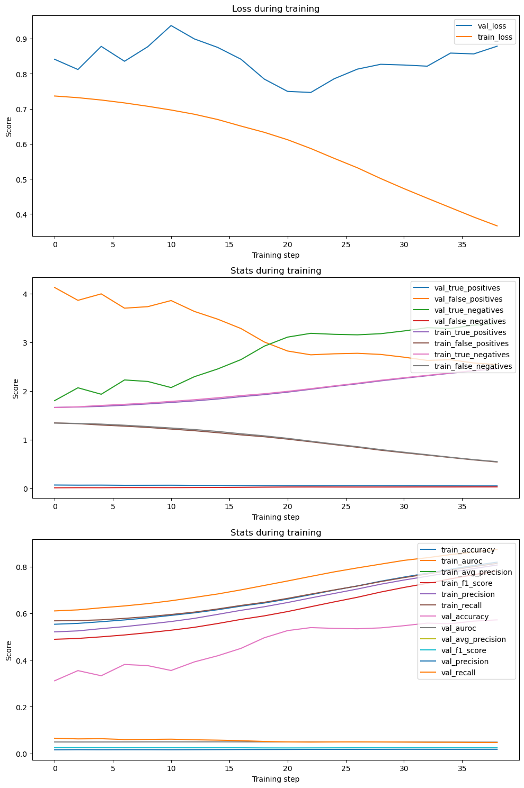
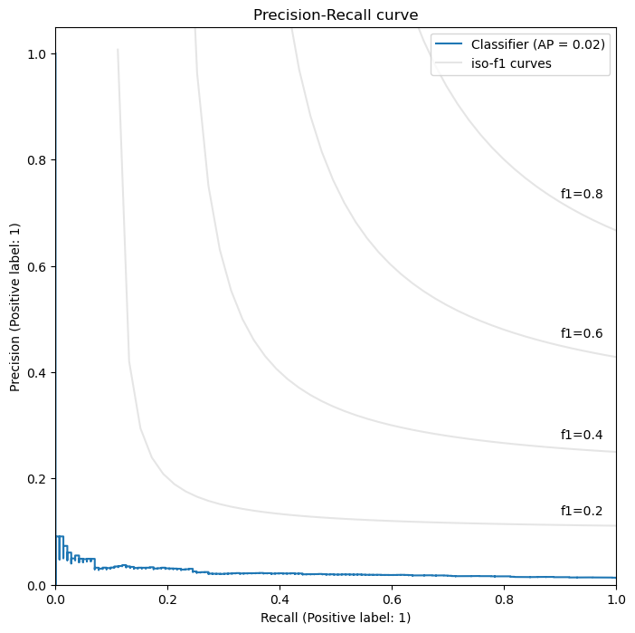
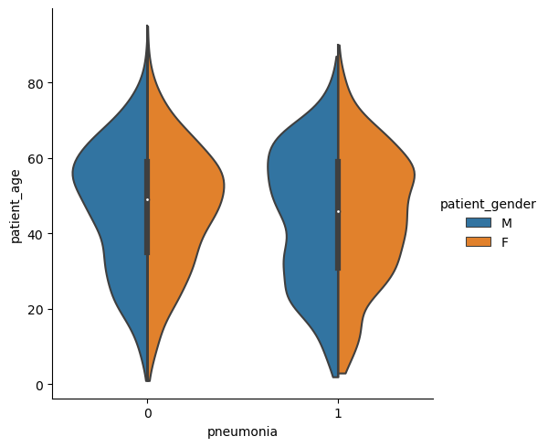
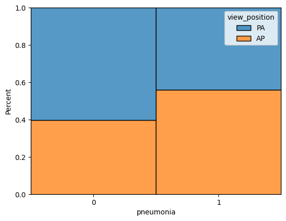
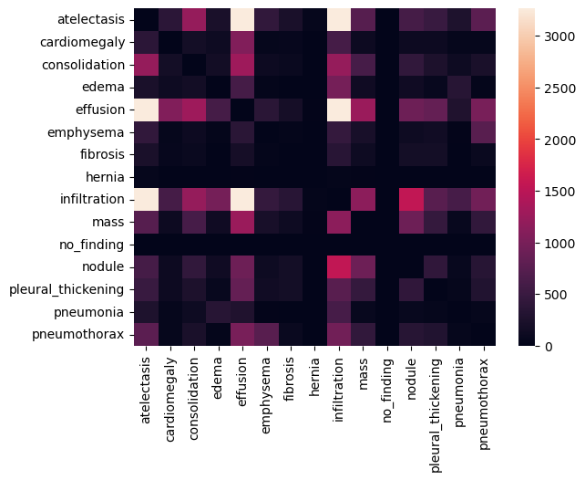

# FDA Submission

**Your Name:**
Carlos Uziel Pérez Malla

**Name of your Device:**
Fast Pneumonia Check

## Algorithm Description

### 1. General Information

**Intended Use Statement:**
This medical device is a tool to discard chest x-ray images of patients where the abscence of pneumonia is apparent thanks to a deep learning predictive model.

**Indications for Use:**
This medical device is meant to be used for patients aged between 20 and 60, both males and females.
It can be incorporated as part of the clinical workflow, as it can make predictions on DICOM files directly.

**Device Limitations:**
This medical device has been designed to prioritize the detection of true cases of pneumonia and thus a negative prediction would be made with a very high confidence. For this reason, it is highly sensitive to any abnormality found on chest x-ray image. Therefore, positive results returned by the medical device need to be checked by a professional radiologist for the presence of pneumonia, or one of its most common comorbidities such as infiltration, edema or effusion.

**Clinical Impact of Performance:**
As mentioned in the last sections, this device has been designed to prioritize high confidence negatives predictions and full coverage of all potentially positive cases. Consequently, all positive results must be checked by a radiologist to evaluate whether it is a true case of pneumonia, one of its most common comorbidities or something else.

### 2. Algorithm Design and Function

#### DICOM Workflow

**DICOM Checking Steps:**
DICOM files are read and are only sent downstream if they represent chest x-ray images taken from AP or PA viewpoints. Grayscale pixel data is transformed to 3 channels to fulfill the algorithm requirements.

**Preprocessing Steps:**
Images are cropped to 224 pixels in height and width and normalized.

**CNN Architecture:**
The architecture is a MobileNet V3 (Large).

### 3. Algorithm Training

**Parameters:**

- Data augmentation included random horizontal flips and random affine transformations (rotation and translation).
- Batch size was set to 6 due to lack of dedicated GPU resources.
- The chosen optimizer was Adam, with a learning rate of 0.02.
- All layers except the last layer of the MobileNet V3 (Large) architecture were frozen.
- The last convolutional block was fine-tuned, and the last classifier layer was changed to contain a single fully-connected layer.

The following plot shows multiple performance metrics on the training (train) and validation (val) sets during training:

#### Algorithm training performance visualization

The following plot shows the final PR curve on the test set:

#### Precision-Recall Curve

**Final Threshold and Explanation:**
The final threshold chosen was `0.0014`, which was the threshold that maximized recall and precision, in that order of preference. We prioritize recall because high recall tests are good for screening or worklist prioritization, which fit the use case of this medical device.

### 4. Databases

The most relevant patient metadata fields, gender and view position, were not too different between cases of presence and abscence of pneumonia, as can be seen in the followin two figures:

#### Gender Distribution

#### View Position Distribution

Likewise, below in the comorbidites matrix, it can be seen that pneumonia is commonly diagnosed alongside infiltration, edema and effusion.

#### Comorbidity Matrix

**Description of Training Dataset:**

Consisting of 2,316 sample images, they are characterized as follows:

- 50/50 balance of positive and negative cases of pneumonia.
- 57% of samples come from males, whereas 43% come from females.
- 52% of images where taken posterior to anterior (AP), whereas 48% were taken from anterior to posterior (AP).

**Description of Validation Dataset:**

Consisting of 2,316 sample images, they are characterized as follows:

- Imbalanced label distribution as in the original dataset, where only 1% of the images were annotated with pneumonia.
- 56% of samples come from males, whereas 44% come from females.
- 59% of images where taken posterior to anterior (AP), whereas 40% were taken from anterior to posterior (AP).

### 5. Ground Truth

The ground truth labels were generated using Natural Language Processing (NLP) to text-mine disease classifications from the associated radiological reports. The authors of the [original paper](https://www.nih.gov/news-events/news-releases/nih-clinical-center-provides-one-largest-publicly-available-chest-x-ray-datasets-scientific-community) claim a labeling accuracy of over 90%.

Ideally, labels would have been curated by not only one, but several expert radiologists. Then, using a voting system to combat inter-rated disagreement and optionally weighted by factors such as years of experience, the final label would be decided. This method would offer a much more accurate labeling of the images. It would however be extremely expensive and time consuming, which is why in practice researchers make use of automated systems to label large sets of images.

### 6. FDA Validation Plan

**Patient Population Description for FDA Validation Dataset:**
We would request imaging data with the following qualities:

1. From patients aged 20 to 60.
2. For both females and males.
3. Chest x-ray images.
4. With prevalence of pneumonia.
5. Common comorbidities such as effusion should be included to test the robustness of the predictions.

**Ground Truth Acquisition Methodology:**
Optimal ground truth labels acquisition would follow the same principles explained above. That is, it would follow a weighted voting system of multiple expert radiologist to ensure a ver high labeling accuracy.

**Algorithm Performance Standard:**

We would make use of precision, recall and F1 scores to determine the final performance of the algorithm.
